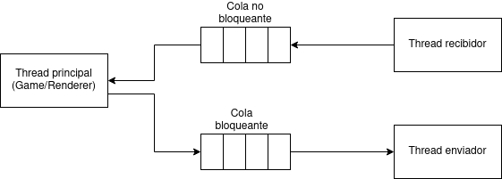
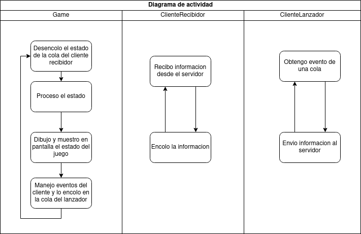
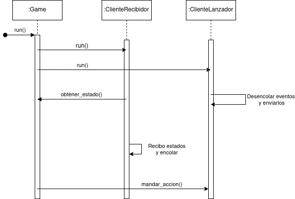
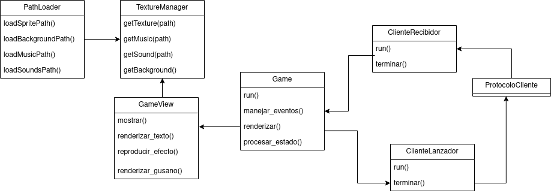

# Documentacion tecnica

El proyecto se divide en 4 partes fundamentales: 

El servidor que se encarga de aceptar conecciones entrantes, recibir y enviar información a los distintos clientes, mantener la lógica del juego y simular las físicas.

El cliente, se encarga de recibir los comandos del usuario, enviarlos al servidor, recibir las respuestas del servidor y mostarlas en pantalla.

El protocolo que se encarga de comunicar al servidor con los clientes mediante el envío de información.

El editor de mapas que permite crear tus propios mapas y editarlos.

## Cliente

El cliente esta dividido en 2 partes: el lobby y el juego

### Lobby del cliente

### Juego del cliente

El juego cliente esta compuesto por 3 threads:
- El thread principal que se encarga de recibir la información desde el servidor, a través de una queue no bloqueante y mostrarla por pantalla, además de tomar las acciones del cliente y colocarlas en una queue bloqueante para que sean enviadas al servidor.
- Un thread que se encarga de recibir información del servidor y lo coloca en una queue no bloqueante
- Un thread que se encarga de recibir la información del cliente a través de una cola bloqueante y enviarsela al servidor

Diagrama de los threads del cliente

Diagrama de flujo de los threads del cliente

Diagrama de interaccion entre threads

**Diagrama de clases con las clases más importantes del cliente**

La clase Game obtiene, comunicandose con ClienteRecividor mediante una cola no bloqueante, información desde el servidor y la procesa dentro del método procesar_estado(), para actualizar el estado de juego, los gusanos, entre otras.

La cola es no bloqueante para que la clase Game pueda seguir renderizando aunque no recibe nuevos estados desde el servidor.

La clase Game también se comunica con la clase GameView tanto para mostrar graficamente el juego asi como también para reproducir la música y efectos de sonido, los cuales son almacenados en la clase TextureManager. Siempre que se necesite obtener una textura o audio se debe llamar a esta clase y en el caso que se requiera cargar mas texturas o sonidos, se hace dentro de la clase PathLoader que se encarga de cargar los path correspondientes a las distintas texturas y sonidos para que el TextureManager los guarde.

La clase Game también se comunica con el ClienteLanzador mediante una cola bloqueante para enviar los eventos del cliente que son manejados por el método manejar_eventos() al servidor.

Para modelar al gusano se tiene la clase JugadorDTO con toda la información del gusano, asi como tambien clases para represenatar las diferentes armas y estados del gusano con el fin de poder guardar la información de forma más ordenada y facilitar las distintas animaciones.

## Server

## Editor

## Protocolo

El protocolo está dividido en 2 clases: ClientProtocol y ServerProtocol, la cuales encapsulan los threads y se encargan de enviar y recibir mensajes entre el cliente y el servidor. ClientProtocol es el protoclo desde el lado del cliente, mientras que ServerProtocol del lado del servidor.

Ambas clases facilitan la comunicacion cliente-servidor mediante métodos para enviar y recibir datos a través de sockets.

También garantiza que los paquetes siempre se reciban de forma correcta mediante la transformación del endianess de los datos mayores a 1 byte a big-endian antes de enviarlos y que luego el host se encargue de pasarlo a su propio endianess.
