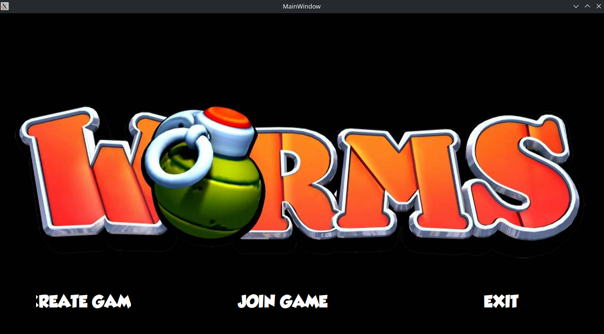
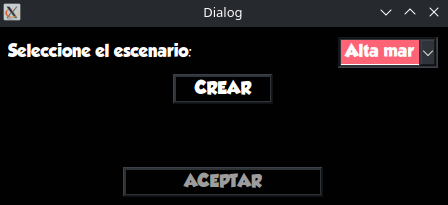
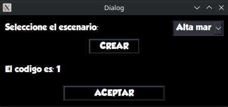
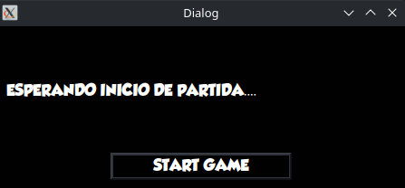
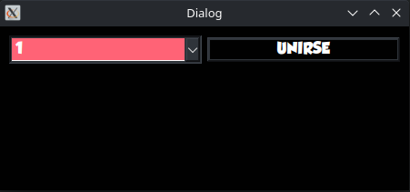
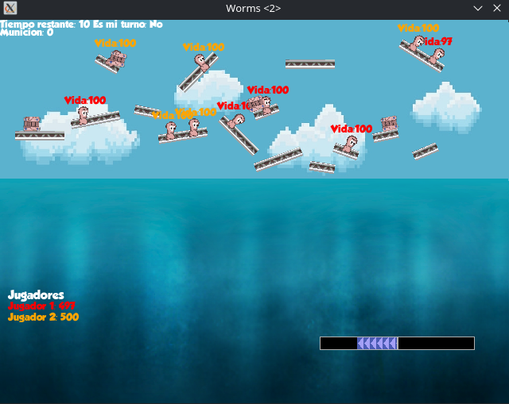

# Manueal de Usuario

## Dependencias
- Sistema operativo linux
- CMake (Version 3.16 o mayor)
- SDL2  (version 2.0.20)
- SDL2_Mixer(version 2.6.3)
- SDL2_Audio(version 2.0.20)
- SDL2_ttf(version 2.20.2)
- QT5(version 5.15.3)
- Box2d(version 2.4.0)
- Yaml-cpp (version 0.7.0)

En caso de no tener las dependencia, se pueden instalar de la siguiente manera:

CMake:
```bash
sudo apt-get install cmake
```

SDL2:
```bash
sudo apt-get isntall libjpeg-dev libpng-dev libfreetype-dev libopusfile-dev libflac-dev libxmp-dev libfluidsynth-dev libwavpack-dev cmake libmodplug-dev libsdl2-dev
sudo apt-get install  libsdl2-mixer-dev libsdl2-image-dev libsdl2-ttf-dev libsdl2-audio-dev libsdl2-gfx-dev
```

QT5:
```bash
sudo apt-get install qt5-default qtbase5-dev qtcreator 
```

Yaml-cpp
```bash

sudo apt-get install libyaml-cpp-dev
```


## Proceso de instalacion:

Descargar el repositorio: https://github.com/Cbravor1991/Whorms

Una vez dentro del repositorio, si no tenés las dependencias, las instalas como esta indicado más arriba.

Luego, realizar los siguientes comandos desde dentro del repositorio:

```bash
mkdir build
cd build
cmake ..
make
```
Con eso ya debería de estar instalado.

## Configuracion
En la carpeta data, se encuetra un archivo configuracion.yaml, el cual permite modificar la vida del gusano, su movimiento, el tiempo por turno, asi como tambien el daño, la municion, el radio de explosión de las armas, entre otras cosas con el fin de que puedas adaptar el juego a tu gusto.

## Editor de mapas
//explicar las funcionalidades, como ejecutarlo, compilarlo y como usarlo

## Ejecucion
Para ejecutar el programa, hay que estar parado dentro de la carpeta build

## Iniciar el servidor
Para ejecutar el servidor, se utiliza el siguiente comando:

`./server <puerto>`

Donde puerto es el puerto que el servidor va a usar para comunicarse con el cliente

## Ejecutar y comenzar partida

El cliente se ejecuta con el siguiente comando:

`./client <ip> <puerto>`

El puerto debe ser el mismo usado para ejecutar el servidor.

Si se desea ejecutar varios clientes en la misma computadora, se puede usar localhost como ip


Cuando se ejecuta el cliente, va a aparecer la siguiente ventana:


Hay tres botones:

**`Create Game`**: Para crear una partida

**`Join Game`**: Para unirse a una partida ya creada

**`Exit`**: Cerrar la ventana

**Create Game**

Si clickeas el boton de Create Game, va a salir la siguiente ventana:



En la esquina superior izquierda se elige el mapa para crear la partida. Una vez elegido el mapa, clickear crear para crear la partida y saldrá el id de la partida para que se puedan unir otros jugadores.



Una vez creada la partida, se le da a acpetar y te manda a la pantalla de espera, donde podes decidir cuando iniciar la partida.



**Join Game**
Si en vez de crear una partida, decidís unirte a una que ya fue creada, clickear en join game.



Va a aparecer la siguiente ventana en la cual podés ver el id de las partidas creadas y unirte a alguna de ellas.

Una vez seleccionas unirse, la ventana se cierra esperando a que el anfitrion de la partida la inicia

## Dentro de la partida
Una vez se inicia la partida, se verá una pantalla como la siguiente:



Se puede observar la siguiente informacion:
- Arriba a la izquierda se puede observar:
    - Tiempo restante del turno
    - Si es tu turno o el de otro jugador
    - Municion del arma actual
- Abajo a la izquierda:
    - Los jugadores con sus respectivos colores y la vida total de todos sus gusanos
- Abajo a la derecha:
    - El sentido y la fuerza del viento actuales

Además, se puede ver la vida de cada gusano arriba de cada uno, el color del jugador al que pertenece el gusano y la mira del gusano que tiene el turno actual

## Controles

**Movimiento**

**`→ `**: Mueve el gusano hacia la derecha

**`←`**: Mueve el gusano hacia la izquierda

**`Enter`**: Salta hacia delante con el gusano

**`Retroceso`**: Salto hacia atrás con el gusano

**Armas**

**`R`**: Cambiar de arma

**`Click izquierdo`**: Disparar arma teledirigida

**`Espacio`**: Sirve para aumentar la potencia del arma(si es que tiene) y disaprarla. Tambien se usa para disparar las armas cuerpo a cuerpo

**`↑`**: Mover la mira hacia arriba

**` ↓ `**: Mover la mira hacia abajo

**Armas con temporizador**

**` 1 `**: Coloca el tiempo de explosión del proyectil en 1 segundo

**` 2 `**: Coloca el tiempo de explosión del proyectil en 2 segundos

**` 3 `**: Coloca el tiempo de explosión del proyectil en 3 segundos

**` 4 `**: Coloca el tiempo de explosión del proyectil en 4 segundos

**` 5 `**: Coloca el tiempo de explosión del proyectil en 5 segundos

**Otros**

**`M`**: Mutear la música


## Armas y tipo de armas
### Tipo de armas:

**`Armas teledirigidas`**: Con las armas teledirigidas el jugador hace click con el
mouse en alguna parte del escenario para determinar el punto exacto donde el arma debería usarse.

**`Armas con mira`**: Algunas armas cuentan con una mira para poder apuntar en que direccion será lanzado el proyectil

**`Armas con potencia`**: Algunas armas permiten ajustar la potencia del disparo.

**`Armas con temporizador`**: Algunas armas se le puede elegir cuanto tiempo tardan en explotar. Por default, el tiempo para explotar des estas armas es 5 segundos.

**`Armas cuerpo a cuerpo`**: Algunas armas solo hacen daño en el lugar donde está el gusano.

### Armas
**`Ataque aereo`**: Arma teledirigida, afectada por el viento que lanza 6 misiles desde el cielo que explotan al impactar.

**`Teletransportación`**: Arma teledirigida, que le permite al gusano moverse de lugar.

**`Bate de Baseball`**: Arma cuerpo a cuerpo que hace daño a los gusanos que se encuentran en el lugar.

**`Dinamita`**: Explosivo cuerpo a cuerpo con temporizador que el gusano deja en el lugar.

**`Bazooka`**: Arma con potencia y mira, afectada por el viento que dispara un misil que estalla al impactar

**`Mortero`**: Igual que el bazooka, pero al explotar libera fragmentos que estallan al impactar

**`Granada verde`**: arma con mira, potencia y temporizador, no afectada por el viento

**`Granada roja`**: como la granada verde pero al explotar lanza fragmentos que estallan al impactar.

**`Granada santa`**: como la granda verde pero con un daño y radio mayor 

**`Banana`**: como la granda verde, pero puede rebotar de forma elástica en las superficies y hace más daño