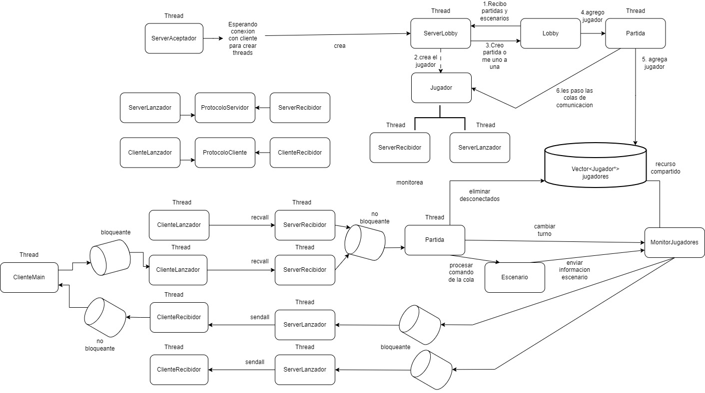

# Whorms

Para compilarlo y ejecutarlo:

Para compilar(dentro del repo):

```bash
    mkdir build
    cd build
    cmake ..
    make
```
Para ejecutarlo, hay que estar parado dentro de la carpeta build y usar los comandos:

- Server:
`./server 8080`

- Cliente:
`./client localhost 8080`


# Diagrama de threads


